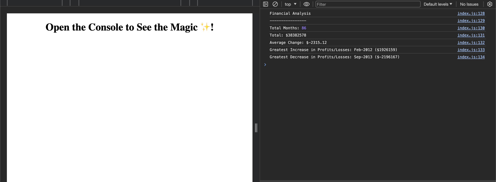

# Console Finances Challenge

## Objective
Develop a JavaScript application to analyse a company's financial records.

## Goal
Process an array-based dataset representing financial records (Date and Profit/Losses) to calculate the data specified in the challenge.

## Preview and Deployment
- **Preview**: 
  

- **Live Demo**: 
  [Try the Live Application](https://calebtkjordan.github.io/Console-Finances/)
